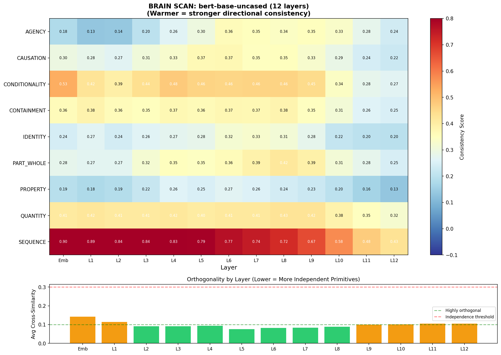
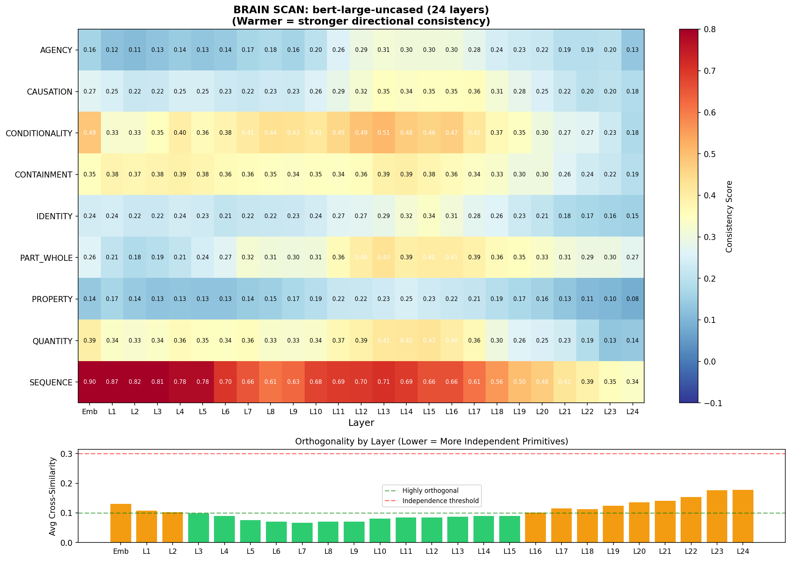
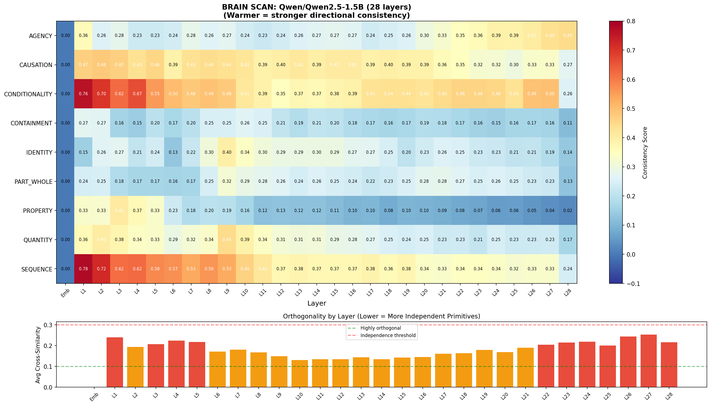
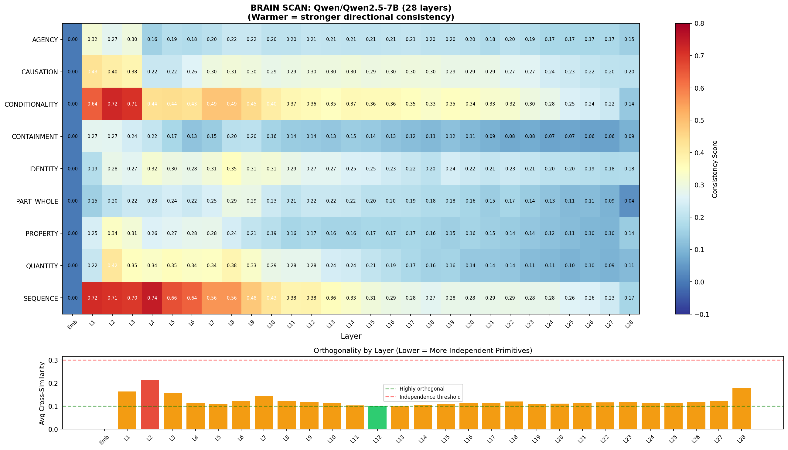
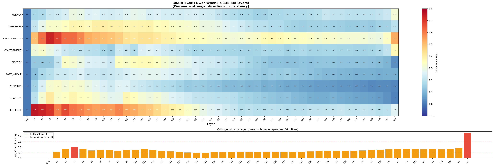

# Geometric Primitives of Meaning

**Probing semantic primitives as geometric directions in transformer internal representations**

**Theoretical Framework:** [The Skeleton in the Machine](the-skeleton-in-the-machine.md) why convergence is inevitable, and what would falsify it.
---

## What is this?

This repository contains the code, data, and results from an exploration testing whether **meaning has geometric structure** inside language models.

The hypothesis: a small set of semantic primitives — causation, agency, containment, sequence, property, quantity, identity, part/whole, and conditionality — correspond to **real, measurable, orthogonal directions** in a model's internal representation space.

## The Nine Primitives

| Primitive | Description |
|-----------|-------------|
| **CAUSATION** | A makes B happen |
| **AGENCY** | Something acts; something is acted upon |
| **CONTAINMENT** | Inside, outside, boundary |
| **SEQUENCE** | Before, after, temporal ordering |
| **PROPERTY** | Attribution — the sky is blue |
| **QUANTITY** | One, many, more, less — the concept of amount |
| **IDENTITY** | Same, other, similar, distinct |
| **PART/WHOLE** | Composition — a hand is part of a body |
| **CONDITIONALITY** | If this, then that |

## Key Findings

**Across five models and two architectures:**

1. **The primitives are real directions.** Consistency scores show they point in the same direction regardless of sentence content.
2. **They are nearly orthogonal.** Average cross-similarity as low as 0.039 — the primitives are genuinely independent dimensions.
3. **They emerge in a developmental hierarchy:** temporal → logical → spatial → causal → abstract → compositional.
4. **The geometry is cleanest in the middle layers** — exactly where reasoning circuits operate.
5. **Three-phase anatomy confirmed:** encoding → reasoning → decoding, matching Ng's RYS-XLarge findings.

## Models Scanned

| Model | Type | Layers | Script |
|-------|------|--------|--------|
| nomic-embed-text | Embedding (137M) | Final layer only | `semantic_primitives_probe.py` |
| bert-base-uncased | Encoder (110M) | 12 + Embedding | `primitives_brain_scanner.py` |
| bert-large-uncased | Encoder (340M) | 24 + Embedding | `primitives_brain_scanner.py` |
| Qwen2.5-1.5B | Decoder LLM | 28 + Embedding | `llm_brain_scanner.py` |
| Qwen2.5-7B | Decoder LLM | 28 + Embedding | `llm_brain_scanner.py` |
| Qwen2.5-14B | Decoder LLM | 48 + Embedding | `llm_brain_scanner.py` |

## Brain Scan Heatmaps

### BERT-base (12 layers)


### BERT-large (24 layers)


### Qwen2.5-1.5B (28 layers)


### Qwen2.5-7B (28 layers)


### Qwen2.5-14B (48 layers)


## How to Run

### Requirements
```
pip install numpy requests torch transformers matplotlib einops
```

### 1. Final-layer probe (uses Ollama)
```bash
# Make sure Ollama is running with nomic-embed-text
ollama pull nomic-embed-text
python semantic_primitives_probe.py
```

### 2. Encoder brain scan (BERT models)
```bash
python primitives_brain_scanner.py bert-base-uncased
python primitives_brain_scanner.py bert-large-uncased
```

### 3. Decoder LLM brain scan (GPU recommended)
```bash
python llm_brain_scanner.py Qwen/Qwen2.5-1.5B
python llm_brain_scanner.py Qwen/Qwen2.5-7B
python llm_brain_scanner.py Qwen/Qwen2.5-14B
```

## Files

**Scripts:**
- `semantic_primitives_probe.py` — Ollama API, final layer only
- `primitives_brain_scanner.py` — Layer-by-layer scan for encoder models (BERT)
- `llm_brain_scanner.py` — Layer-by-layer scan for decoder LLMs (Qwen)

**Heatmaps:**
- `brain_scan_bert-base-uncased.png`
- `brain_scan_bert-large-uncased.png`
- `brain_scan_Qwen2.5-1.5B.png`
- `brain_scan_Qwen2.5-7B.png`
- `brain_scan_Qwen2.5-14B.png`

**Data (.npz):**
- `brain_scan_*_data.npz` — Consistency matrices and orthogonality data for each model
- `primitive_vectors_nomic-embed-text.npz` — Raw difference vectors from Ollama probe
- `mean_primitive_vectors_nomic-embed-text.npz` — Mean primitive direction vectors

## Attribution

The hypothesis, conceptual framework, and experimental design are by **Sheila Machado**. The code, technical implementation, and iterative refinement of ideas were developed in collaboration with **Claude (Anthropic)**.

All experiments were run on an MSI Raider 18 HX laptop with an NVIDIA RTX 5090 (24GB VRAM).

## Related Work

- **David Noel Ng** — [RYS-XLarge: LLM Neuroanatomy](https://dnhkng.github.io/posts/rys/) — Layer duplication revealing transformer functional anatomy
- **Lippl, McGee et al. (2026)** — *Algorithmic Primitives and Compositional Geometry of Reasoning in Language Models* — Algorithmic primitive vectors with geometric compositionality
- **Kaplan et al. (2025)** — *From Tokens to Words: On the Inner Lexicon of LLMs* (ICLR 2025) — Detokenization process in early-to-middle layers

  ## Follow the Research

This work is ongoing. New experiments, findings, and extensions will be posted on X:
(https://x.com/0606Machado)

## License

MIT
